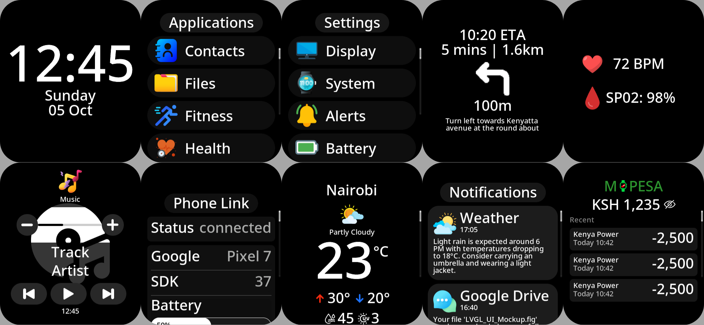
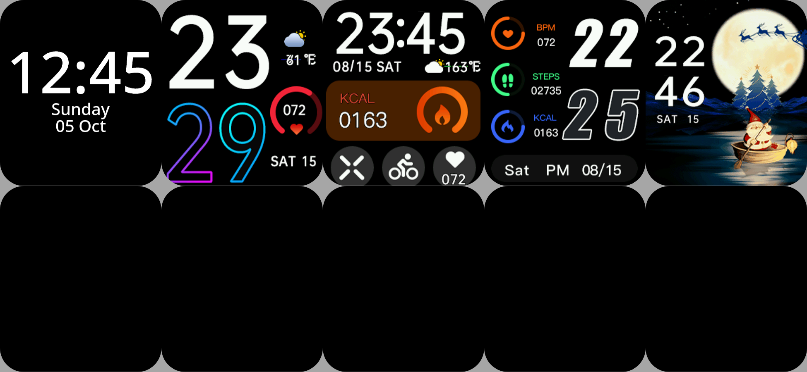

# Helios SF32

Minimal SF32 watch project for LVGL v9 UI work, Chronos-compatible BLE sync, iOS notification/media support, and basic board peripherals.

## Build

Activate the SiFli SDK environment, then build from this repository's `project/` directory:

```bash
source /path/to/SiFli-SDK/export.sh
cd project
scons --board=sf32lb52-lcd_n16r8 -j8
```

This project is intended to live outside the SiFli SDK tree. Keep the `project/` and `src/` folders together, and build from `project/` so the local SCons files can find the application sources.

## What Is Included

- LVGL v9 watch UI imported under `src/helios_ui/`, including generated screens, components, widgets, fonts, images, custom app runtime code, subjects, events, and watchface manager code.
- Built-in app surfaces for home/watchface, applications, settings, notifications, contacts, weather, music, stopwatch, timer, phone link, navigation, and health.
- External watchface sources under `src/faces/`, currently including `174_390`, `228_390`, `1889_2_390`, and `1891_2_390`.
- Board startup in `src/main.c` and app glue in `src/core/helios_app.c`.
- BLE advertising as `HELIOS-xxxxxx` while disconnected.
- Nordic UART Service for Chronos-style phone sync:
  - Service: `6E400001-B5A3-F393-E0A9-E50E24DCCA9E`
  - RX/write: `6E400002-B5A3-F393-E0A9-E50E24DCCA9E`
  - TX/notify: `6E400003-B5A3-F393-E0A9-E50E24DCCA9E`
- Apple Notification Center Service client support for iOS notifications.
- Apple Media Service client support for iOS Now Playing metadata and media controls.
- iOS ANCS app-id to notification-icon mapping for common apps such as WhatsApp, Telegram, Instagram, Gmail, Mail, Messages, Calendar, Snapchat, TikTok, and PayPal.
- MAX30100 heart-rate and SpO2 sampling with finger detection and a configurable last-valid-value cache.
- Basic RT-Thread access helpers for buttons, battery ADC, DFS storage, I2C, and SPI.
- Weather, navigation, contacts, notification, music, health, battery, and connectivity updates are routed into the UI through subject setters or app-runtime queues.

### Helios UI

https://github.com/fbiego/helios_ui



## Repository Layout

```text
.
├── project/                       SiFli/RT-Thread board build project
├── src/
│   ├── apps/                      Hand-written app integrations outside UI sync
│   ├── chronos_core/              Chronos protocol parser/state
│   ├── core/                      Helios platform, BLE, iOS, sensor, and UI glue
│   ├── faces/                     Imported external watchface sources/assets
│   ├── helios_ui/                 Generated LVGL UI plus custom runtime code
│   └── main.c                     RT-Thread app entry point
└── .codex/skills/SKILL.md         Codex project working notes
```

`src/SConscript` pulls `src/main.c`, core sources, app integrations, Chronos core sources, the LVGL generated/custom source lists, custom app sources, and every `.c` file under `src/faces/`. Face folders also generate `ENABLE_FACE_<NAME>` defines for conditional registration.

## UI Runtime

The generated LVGL files live under `src/helios_ui/`. Generated files use `_gen.c` / `_gen.h` naming; prefer placing hand-written behavior in `src/helios_ui/custom/` or the top-level Helios glue files.

Important UI runtime areas:

- `custom/subjects/`: generated subject setters for scalar UI state such as time, date, battery, BLE status, music metadata, health values, settings, and selected icons.
- `custom/apps/`: runtime storage for dynamic app data that should survive screen deletion, including contacts, notifications, stopwatch laps/state, and weather forecasts.
- `custom/events/`: generated/custom UI event callbacks.
- `custom/watchfaces/`: watchface registry, selector behavior, and preview handling.
- `widgets/`: generated custom widget library used by screens and watchfaces.

Screens are created and deleted during navigation, so platform code should not keep long-lived `lv_obj_t *` pointers. Update UI state through `helios_subject_set_*()` functions or app runtime APIs, and use `lv_async_call()` or the wrappers in `src/core/helios_app.c` when data arrives from BLE/sensor tasks.

## Watchfaces

External watchfaces are stored in `src/faces/<face_name>/` with a `.c`/`.h` pair, `items.txt`, `watchface.png`, `preview.png`, and generated image assets. These sources are compiled automatically by `src/SConscript`.

The active watchface is managed by the UI watchface manager in `src/helios_ui/custom/watchfaces/`. The home screen creates the active registered watchface, and a long press opens the selector screen.




When adding a new watchface:

1. Put its source and assets under `src/faces/<stable_tag>/`.
2. Register it through `HELIOS_REGISTER_WATCHFACE(...)` or `helios_watchfaces_register(...)`.
3. Use a stable tag if platform storage will persist the selected watchface.
4. Keep preview images optional for firmware builds unless the selector needs them in flash.

See `src/helios_ui/custom/watchfaces/README.md` for the full registry API.

## BLE and iOS Notes

`src/core/helios_ble.c` owns the local Nordic UART Service registration and advertising data. Chronos protocol handling stays in `src/core/helios_chronos.c`; use `helios_ble_send()` for outbound packets and `helios_chronos_on_rx()` for inbound writes.

iOS ANCS and AMS are remote services exposed by the iPhone after a BLE connection. The watch acts as a GATT client for those services in `src/core/helios_ios.c`.

The expected iOS flow is:

1. Connect to `HELIOS-xxxxxx` from a BLE-capable app, such as nRF Connect, or from a future Helios iOS app.
2. Accept the iOS pairing prompt.
3. After bonding/encryption completes, the firmware refreshes ANCS/AMS subscriptions.
4. In iOS Bluetooth settings, the device may then show `Share System Notifications` behind the device info button.

Plain iOS Bluetooth Settings may not show arbitrary BLE-only peripherals before an app has connected to them. If ANCS notifications do not arrive, forget the device on iOS, reconnect, accept pairing, and verify the serial logs show `ANCS ready result=0` after bonding.

## Health Sensor

`src/core/helios_max30100.c` initializes and samples the MAX30100 on the configured I2C bus. It publishes heart rate and SpO2 readings to the health UI, tracks finger presence, and keeps the last valid value for a configurable cache timeout so values do not instantly drop to zero when the finger is removed.

Useful APIs:

- `helios_max30100_begin(i2c_name)`
- `helios_max30100_start_measuring(callback, user_data)`
- `helios_max30100_set_cache_timeout_ms(timeout_ms)`
- `helios_max30100_set_finger_threshold(ir_threshold)`
- `helios_max30100_stop_measuring()`

Samples include raw red/IR values, `finger_detected`, `cached`, `beat_detected`, `heart_rate_bpm`, and `spo2_percent`.

## Platform Helpers

`src/core/helios_platform.c` keeps board-specific access behind small helpers:

- Battery: `helios_battery_read()`, using the board ADC channel.
- Buttons: `helios_button_pressed()`.
- I2C: `helios_i2c_bus()`.
- SPI: `helios_spi_device()`.
- Storage: RT-Thread DFS/MTD helpers should be used rather than hard-coded flash offsets.

Keep display and touch access abstracted through `littlevgl2rtt_init("lcd")`.

## Key Files

- `project/proj.conf`: project feature/config flags, including Bluetooth, ANCS/AMS, FlashDB, LVGL, and button support.
- `src/SConscript`: source discovery for top-level code, Chronos core, generated/custom UI, custom apps, and external faces.
- `src/main.c`: RT-Thread app startup.
- `src/core/helios_ble.c`: advertising, Nordic UART Service, connection, bonding, and BLE event glue.
- `src/core/helios_chronos.c`: Chronos protocol bridge and fallback media commands.
- `src/core/helios_ios.c`: iOS ANCS/AMS discovery, subscription refresh, notification mapping, and media updates.
- `src/core/helios_app.c`: LVGL-safe app update queueing for notifications, music, weather, navigation, and health.
- `src/core/helios_max30100.c`: MAX30100 sensor sampling, heart-rate/SpO2 calculation, finger detection, and cached readings.
- `src/core/helios_platform.c`: board access helpers for battery, buttons, buses, and storage.
- `src/helios_ui/custom/apps/API.md`: UI runtime API reference for platform-facing code.
- `src/helios_ui/custom/watchfaces/README.md`: watchface registration and selection guide.
